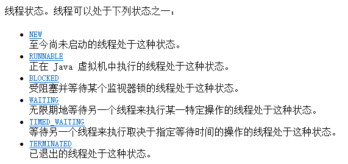
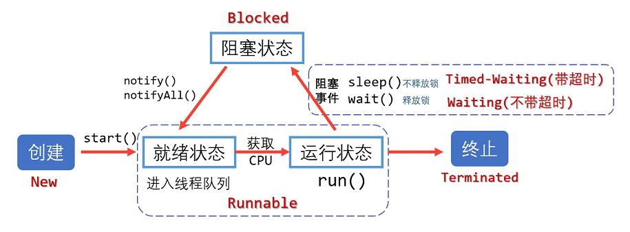

# Java Multithread
> 参看[ Java多线程看着一篇足够了！](http://blog.csdn.net/zhangliangzi/article/details/51490945)
## 一、多线程基础
### 1. 进程
程序的执行过程，持有资源（共享内存，共享文件）和线程
- 执行过程是动态性的；
- 进程是资源的载体，也是线程的载体；

### 2. 线程
理解线程
- 线程是系统中最小的执行单元；
- 统一进程汇总有多个线程；
- 线程共享进程的资源。

### 3. 线程的生命周期





## 二、Java多线程
### 1. Java实现多线程
> 继承java.lang.**Thread**类 或 实现java.lang.**Runnable**接口；
> 重写**run()**方法。

1. 继承Thread类
``` java
public class MyThread extends Thread {
   public void run(){
	   ... ...
   }
}
```

运行
``` java
MyThread myThread = new MyThread();
myTread.start();
```

2. 实现Runnable接口
``` java
public class MyRunnable implements Runnable {
   public void run(){
	   ... ...
   }
}
```

运行：
``` java
Thread thread = new Thread(new MyRunnable());
thread.start();
```
> 注意：
> 启动一个线程是调用 start()方法，而不是run()方法；
> 一般实现多线程以实现Runnable接口为主；

### 2. Thread与Runnable的对比
1. Runnable方式可以避免Thread方式由于Java单继承带来的缺陷；
2. Runnable可以创建多个Thread实例（被多个线程共享），适合于多个线程处理同一资源的情况；
3. Runnable方式可以使代码被多个线程共享，增加代码的健壮性；
4. 线程池只能放入实现Runable或callable类线程，不能直接放入继承Thread的类。

### 3. Thread常用方法
1. void start()：启动线程；
2. static void sleep()：线程休眠；


### 4. 其他方法
#### 1. extends Thread类
1. getName()：获得当前线程的名字；
2. thread.setName()：设置制定线程的名字；

#### 2. 实现Runnable接口
1. Thread.currentThread().getName()：获取当前线程的名字；
2. 设置线程名字有两种方法：
 - Thread构造器，接受Runnable实现累的时候，同时传入名称；
 - thread.setName();

### 5. Volatile 关键字
保证了线程可以正确的读取其他线程写入的值；

### 6. yield 方法
static void yield()：当前运行线程释放处理器资源
> yield让出 CPU 执行权给同等级的线程，如果没有相同级别的线程在等待 CPU 的执行权，则该线程继续执行。

### 7. join 方法
void join()：所有线程等待调用join方法的线程运行完成后再运行；
> 应用在在许多结束程序的地方。

## 三、线程停止
### 1. 错误方法：stop();
会使线程突然停止，无法实现应有的清理工具；

### 2. 正确方法：使用退出标志
``` java 
volatile boolean keepRunning = true;

while (keepRunning) {
	... ...
}
```
如需停止线程，设置keepRunning为false即可。

## 二、线程中断
### 1. 中断线程：
`Thread.interrupt();`
1.  如果只是单纯的调用 interrupt()方法，线程并没有实际被中断，会继续往下执行;
2. 终端只会影响到wait状态、sleep状态和join状态。被打断的线程会抛出InterruptedException。 

### 2. 判断中断状态
1. 判断*指定*线程是中断状态`Thread.isInterrupted();`
> 线程一旦被中断，`isInterrupted()`方法便会返回 `true`，而一旦 抛出异常（比如`sleep()`方法跑出异常），它将清空中断标志，此时`isInterrupted()`方法将返回 `false`。

2. 判断*当前*线程是中断状态：`Thread.interrupted();`
> 第一次中断调用该方法后自动重置中断状态为 `false`，第二次调用 `Thread.interrupted()`方法，总是返回 `false`，除非中断了线程。

## 三、线程交互
- 互斥
- 同步

### 1. 征用条件
多个线程同时共享同意数据（内存区域）时，每个程序都尝试该操作，从而导致数据被破坏，这一现象就是征用条件。

### 2. 线程的交互
互斥与同步
#### 1. Java实现互斥：synchronized关键字
采用 synchronized 修饰符实现的同步机制叫做互斥锁机制，它所获得的锁叫做互斥锁。
1. synchronized代码块
``` java
public class ThreadDemo implements Runnable {
   private final Object lock = new Object();
   public void run() {  
       synchronized(lock){
         ..do something
       }
   }
}
```

2. synchronized修饰方法
``` java
public class ThreadDemo implements Runnable {
   public synchronized void run() {  
        ..do something
   }
}
```
> 如果修饰的是static方法，则锁定该类所有实例。

#### 2. Java实现线程同步
1. Object.wait(); 线程休眠

2. Object.notifyAll(); 唤醒所有休眠线程

3. Object.notify(); 唤醒随机一个线程；

> wait/notify必须存在于synchronized块中。

## 四、守护线程
### 1. 线程分类
线程有两类：
#### 1. 用户线程
运行在前台，执行具体任务，如程序的主线程、连接网络的子线程等；

#### 2. 守护线程
运行在后台，为其他前台线程服务（如：垃圾回收线程）
1. 特点：一旦所有用户线程都结束运行，守护线程会随JVM一起结束工作；
2. 应用：数据库连接翅中的监测线程、JVM虚拟机启动后的监测线程。

### 2. 守护线程的使用
#### 设置守护线程
调用Thread类的setDaemon(true)设置当前线程为守护线程
``` java
thread.setDaemon(true);
```

> 注：
> 1. setDaemon(true)必须在start()方法前调用，否则会抛出IllegalThreadStateException异常；
> 2. 守护线程中产生的新线程也是守护线程；
> 3. 不是所有的任务都可以分配给守护线程来执行，如读写操作或计算逻辑。

## 五. jstack生成线程快照
### 1. jstack介绍
1. jstack的位置：在java jdk的bin目录下
2. 作用
生成JVM当前时刻线程的快照
3. 目的
宝珠定位程序问题出现的原因，如长时间停顿、CPU占用过高等

### 2. 使用jstack
dos窗口下


## 六、线程池
> 参考极客学院WiKi：[并发新特性—Executor 框架与线程池](http://wiki.jikexueyuan.com/project/java-concurrency/executor.html)

线程池的实现与操作依赖于Executor框架
### 1. 创建线程池
Executors 提供了一系列工厂方法用于创先线程池，返回的线程池都实现了 ExecutorService 接口。

| 方法                      | 介绍                      |
|:--------------------------|:-------------------------|
| public static ExecutorService newFixedThreadPool(int nThreads)| 创建一个可重用固定线程数的线程池|
|public static ExecutorService newCachedThreadPool() |  创建一个可根据需要创建新线程的线程池    |
|public static ExecutorService newSingleThreadExecutor()|   创建一个单线程化的Executor       |
|public static ScheduledExecutorService newScheduledThreadPool(int corePoolSize)| 创建一个支持定时及周期性的任务执行的线程池|

### 2. 自定义线程池
用 ThreadPoolExecutor 类创建自定义线程池，它有多个构造方法来创建线程池
``` java
public ThreadPoolExecutor (int corePoolSize, int maximumPoolSize, long keepAliveTime, TimeUnit unit,BlockingQueue<Runnable> workQueue)
```
- corePoolSize：线程池中所保存的核心线程数，包括空闲线程。
- maximumPoolSize：池中允许的最大线程数。
- keepAliveTime：线程池中的空闲线程所能持续的最长时间。
- unit：持续时间的单位。
- workQueue：任务执行前保存任务的队列，仅保存由 execute 方法提交的 Runnable 任务。

## 七、Lock锁
### 1. 认识Lock接口
1. 显式的互斥锁，在java.util.concurrent.locks中
2. Lock接口的三个实现类
- ReentrantLock：重入锁
- ReetrantReadWriteLock.ReadLock：读锁
- ReetrantReadWriteLock.WriteLock：写锁

### 2. 使用Lock锁
#### 1. 一般形式
``` java
Lock lock = new ReentrantLock();//默认使用非公平锁，如果要使用公平锁，需要传入参数true  
........  
// lock.lockInterruptibly();//获取响应中断锁
lock.lock();  // 加锁
try {  
     //更新对象的状态 
	 //如果有return语句，放在这里  
} catch(Exception e) {
	... ...
} finally {  
       lock.unlock();        //锁必须在finally块中释放  
}
```
> 注：
> 1. 把互斥区放在 try 语句块内；
> 2. return 语句必须放在 try 字句中；
> 3. 在 finally 语句块中释放锁

#### 2. 实现同步
``` java
private Lock lock = new ReentrantLock(); 
private Condition condition = lock.newCondition(); //产生一个Condition对象  

lock.lock();  
try{  
	condition.await() ;  // 挂起
    ... ...
    condition.signal();  // 唤醒
}catch(InterruptedException e){   
    ... ...
}finally{  
	lock.unlock();  
}  
```

### 3. 与Synchronize关键字的区别
1. Lock 有比 synchronized 更精确的线程语义和更好的性能；
2. Lock 必须被显式地创建、锁定和释放
3. Lock提供多种加锁方案，lock 阻塞式, trylock 无阻塞式, lockInterruptily 可打断式， 还有trylock的带超时时间版本。

## 八、其他参考
1. [Java线程池详细介绍](http://www.codeceo.com/article/java-thread-pool-intro.html#0-qzone-1-49223-d020d2d2a4e8d1a374a433f596ad1440)
2. [java Future用法和意义一句话击破](https://www.oschina.net/question/54100_83333)
3. [java多线程之生产者消费者经典问题](http://blog.csdn.net/thinkpadshi/article/details/8163751)