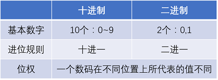
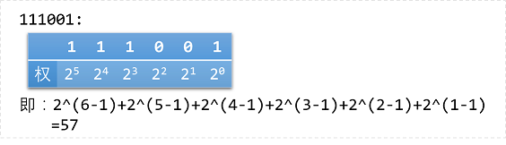
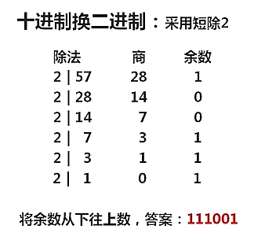
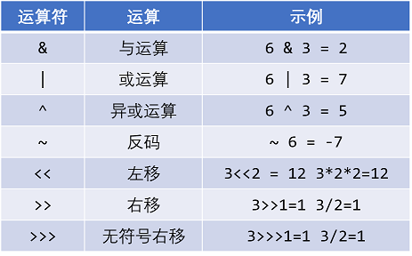
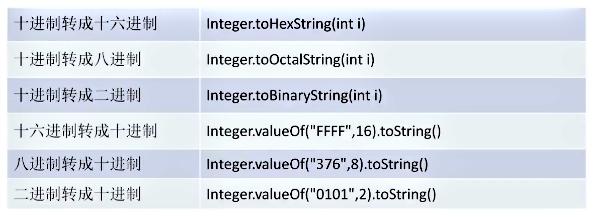
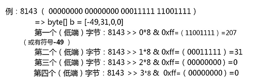

# 二进制基础
## 一、二进制


### 1. 二进制转换十进制
科学计数法，按权展开



> 负数的二进制表示用补码表示，补码=反码+1；

### 2. 十进制转二进制
采用短除2的方法



> 求商与余数的相关概念：
> 给定一个正整数`p`，任意一个整数`n`，一定存在等式`n = kp + r`；
> 其中`k`、`r`是整数，且`0 <= r < p`，称`k`为`n`除以`p`的商，`r`为`n`除以`p`的余数。

### 3. 适合计算机的进制
1. 二进制：运算简单，简化计算机结构；
2. 八进制：适用于12位和36位系统，表示数字0~7；
3. 十六进制：0~9，ABCDEF表示，表示长度更短，变得更常用，开头用0x标识；

## 二、二进制位运算


优点： 特定情况下，计算方便，速度快，被广泛支持；
### 1. 按位与`&`
1. 两位全为1，结果才为1；
2. 位运算的特殊用法
- **清零**：将一个单元的二进制位与一个各位都是0的数值相与，即可将此单元清零；
- **取一个数中指定位**：找一个数，对应X要取的位，该数的对应位为1，其余位为0，两数进行与运算即可得到。

### 2. 按位或`|`
1. 只要有一个为1，结果就为1；
2. 或运算的特殊用法：
- **对数据的默写位置1**：找一个数，对应X要置1的位，该数的对应位为1，其余位为0，两数进行或运算即可得到。

### 3. 异或运算`^`
1. 两个相应位不同，结果为1；
2. 异或运算的特殊用法：
- **特定位翻转**：一个数，对应X要翻转的位，该数的对应位为1，其余位为0，两数进行异或运算即可得到；
- **与0相异或，保留原值**；
- **两个变量交换值的方法**：利用一个数异或本身等于0和异或运算符合交换律；
> 如：A=A^B; B=A^B; A=A^B;

### 4. 取反运算`~`
对一个二进制数按位去翻，将0变为1，将1变为0；

### 5. 左移运算`<<`
1. 将一个运算对象的个二进制位全部左移若干位，左边的二进制位丢弃，右边补0；
2. 若左移时舍弃的高位不包含1，则每左移以为，相当于该数乘2。

### 6. 右移运算`>>`
1. 将一个运算对象的个二进制位全部右移若干位，正数左补0，负数左补1，右边丢弃；
2. 操作数每右移一位，相当于该数除以2；

### 7. 无符号右移运算`>>>`
1. 各个位右移若干位，右移后左边补0，右边丢弃；


### 8. 负数的二进制表示
负数以其正值的补码形式表示
1. 原码：一个整数按照绝对值大小转换成的二进制数；
2. 反码：将二进制数按位取反，所得新二进制数为原二进制数的反码；
3. 补码：反码加1；

## 三、JDK内置进制转换


## 四、Java中的进制
1. Java处理的是高层，平时开发中“进制转换”和“位操作”用的不多；
2. 在跨平台中用的较多，如：文件读写，数据通信；
### 1. Java中的数据类型
**基本类型**
1. int数据类型有：byte(8bit, -128~127)、short(16bit)、int(32bit)、long(64bit)；
> 一个字节为8位；

2. float数据类型：单精度（32bit float）、双精度（64bit double）;
3. boolean类型的取值：true、false，占1bit；
4. char数据类型：Unicode字符，16bit（2字节）；

**对应的包转类型**
Integer、Float、Boolean、Character、Double、Short、Long、Byte

### 2. 数据类型转化字节
#### 1. int转化为字节

> 注意：
> - 此处用到了&的一个特殊用法——用来取指定位数0x开头代表十六进制；
> - F二进制代表1111，则0xff代表1111 1111；
> - 0*8就是没有移，然后做按位与运算（&0xff），得到第一个低端位；
> - 1*8就是像右移8位，那么舍弃掉右边的8位，就得到第二个低端位
> - 以此类推；

**存储方法**
1. 小端法（Little-Endian）：低位字节排放在内存的低地址端即改制的起始地址，高位字节排放在内存的高地址端；
2. 大端法（Big-Endian）：高位字节排放在内存的低地址端即改制的起始地址，低位字节排放在内存的高地址端；

#### 2. 字符串转化为字节
1. 字符串`-->`字节数组
``` java
String s = "... ...";
byte[] bytes = s.getBytes();
```
2. 字节数组`-->`字符串
``` java
byte[] bytes = new byte[int];
String s = new String(bs, encode);
```

## 参考资料
- [位运算的威力](http://blog.csdn.net/iukey/article/details/7195265)
- [大小端详解](http://blog.csdn.net/zhaoshuzhaoshu/article/details/37600857)