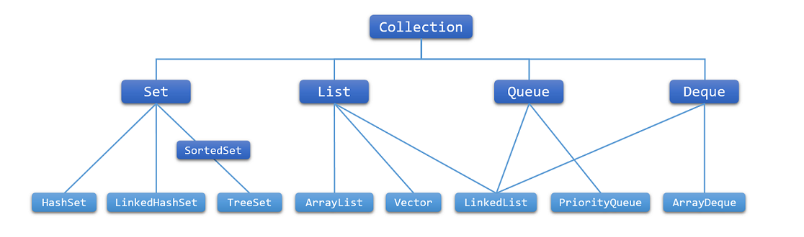
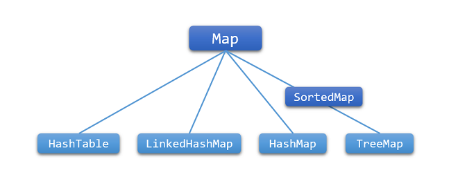

# Java Collections Framework
[Collection Framework官方介绍](http://docs.oracle.com/javase/7/docs/technotes/guides/collections/overview.html)
[Java Collection Tutorials](http://docs.oracle.com/javase/tutorial/collections/index.html)

## 一、集合简介
1. Java集合框架设计的初衷是为了是减少工作量。Java集合框架的核心元素包括：接口，实现类，聚合操作和算法。
2. 集合（有时称为容器）就是将多个元素组合为一个单元的对象。集合常用于储存，检索，操作和传递汇总数据。
3. 集合框架是用于表示和操作集合的统一架构，所有集合包含以下内容：
- 接口：表示集合的抽象数据类型。接口允许独立于稽核表式的细节去操作集合。
- 实现类：集合框架的具体实现，本质上是可重用的数据结构。
- 算法：对实现了集合框架的对象进行有用的计算，比如查询和排序。这些算法被人为是多态的，即相同的方法可以用于许多不同适当的集合接口实现类上。实质上，算法可重用。

## 二、集合框架体系结构
### 1. Collection

1. Set：不包含重复元素的集合；
2. List：有序集合（可称为序列），可以包含重复序列；
3. Queue/Deque：在处理之前保存多个元素的集合；

### 2. Map

 Map：键映射到值的对象，一个Map的键不和重复，一个键最多映射一个值。

### 3. 主要实现

| Interface |  Hash Table | Resizable Array |  Tree   |  Linked List |  Hash Table + Linked List |
| :--------:| :--------: | :------:  |:------: |:------: |:------: |
|    Set    |   HashSet  |    -    |   TreeSet  |   -  | LinkedHashSet |
|    List   |   -   |  ArrayList  |   -  |LinkedList | -  |
|   Queue   |   -   |  ArrayList  |  -  |   -  |  -  |
|   Deque   |   -   |  ArrayDeque  |  -  |  LinkedList |  -  |
|   Map     | HashMap  |  -  |  TreeMap  |   -    |  LinkedHashMap  |
> 说明：Queue还有一个通用实现为PriorityQueue，是基于Priority Heap实现的

### 4. 算法
- 算法都封装在Collections类中，且这些算法都是静态的；
- 这些算法大多数都用于处理List实例，少部分可以用于任意Collection实例。

#### 1. 排序（sorting）
- `Collections.sort(sort(List<T> list) );` —— 根据元素的自然顺序 对指定列表按升序进行排序。
- `Collections.sort(List<T> list, Comparator<? super T> c)` —— 根据指定比较器产生的顺序对指定列表进行排序。 

> sort()方法使用的是优化过的归并排序（merge sort）

#### 2. 重置排列（Shuffling）
- `shuffle(List<?> list)` —— 使用默认随机源对指定列表进行置换。
- `shuffle(List<?> list, Random rnd)` —— 使用指定的随机源对指定列表进行置换。

> shuffle()方法常用于机会游戏，如纸牌游戏。

#### 3. 常见数据操作
Collections类提供了五个List的常见数据操作：
1. `reverse(List<?> list) ` ——  反转指定列表中元素的顺序。
2. `fill(List<? super T> list, T obj) ` —— 使用指定元素替换指定列表中的所有元素。（对于重新初始化List很有用）
3. `copy(List<? super T> dest, List<? extends T> src)` —— 将所有元素从一个列表复制到另一个列表。
4. `swap(List<?> list, int i, int j) ` —— 在指定列表的指定位置处交换元素。
5. `addAll(Collection<? super T> c, T... elements) ` —— 将所有指定元素添加到指定 collection 中。

#### 4. 搜索（Searching）
- `binarySearch(List<? extends Comparable<? super T>> list, T key) ` —— 使用二分搜索法搜索指定列表，以获得指定对象。（该方法假定List中按照元素的自然排序规则自然排序）
- `binarySearch(List<? extends T> list, T key, Comparator<? super T> c)` —— 使用二分搜索法搜索指定列表，以获得指定对象。

> 可以在调用binarySearch()方法之前先调用sort()方法。

#### 5. 组成特点（Composition）
测试一个或多个Collections组成的一些特点：
- `frequency(Collection<?> c, Object o)` —— 返回指定 collection 中等于指定对象的元素数。
- `disjoint(Collection<?> c1, Collection<?> c2)` —— 如果两个指定 collection 中没有相同的元素，则返回 true。

#### 6. 极限值（Extreme Value）
- `max/min(Collection<? extends T> coll) `—— 根据元素的自然顺序，返回给定 collection 的最大元素/最小元素
- `max/min(Collection<? extends T> coll, Comparator<? super T> comp)` —— 根据指定比较器产生的顺序，返回给定 collection 的最大元素/最小元素。

## 三、各实现类的对比
### 1. ArrayList和Vector
**相同点**
- 都实现了List的接口；
- 存储元素都是有序的，相当于动态数组，可以安位置索引号取出任意元素；
- 存储元素可重复。

**不同点**
#### 1. 同步性
1. Vector是线程安全的，即其方法之间是线程同步的；
2. ArrayList不是线程安全的，其方法之间线程不同步。

> 如果只有一个线程访问集合，最好是使用 ArrayList，因为它不考虑线程安全，效率会高些；如果有多个线程访问集合，最好是使用 Vector，因为不需要我们自己再去考虑和编写线程安全的代码。

#### 2. 数据增长
Arraylist和Vector默认初始大小均为10，都提供了可以设置初始空间的构造函数。当元素个数查过容量使就会增加多个存储单元，每次增加的存储单元的个数在内存空间利用与程
序效率之间要取得一定的平衡。
- Vector默认增长为原来容量的两倍，用户可以自定义增长的空间大小；
- ArrayList默认增长为原来容量的0.5倍，用户无法自定义。

### 2. ArrayList,Vector, LinkedList 的存储性能和特性
1. ArrayList 和 Vector 都是使用数组方式存储数据，此数组元素数大于实际存储的数据以便增加和插入元素；
2. ArrayList 和 Vector索引数据快而插入数据慢：都允许直接按序号索引元素，但是插入元素要涉及数组元素移动等内存操作。 
3. Vector 由于使用了 synchronized 方法（线程安全），通常性能上较 ArrayList 差；
4. LinkedList 遍历速度慢，插入速度快：使用双向链表实现存储，按序号索引数据需要进行前向或后向遍历，但是插入数据时只需要记录本项的前后项即可，所以插入速度较快。
5. LinkedList 是线程不安全的， LinkedList 提供了一些方法，使得 LinkedList 可以被当作堆栈和队列来使用

### 3. HashMap 和 Hashtable
**相同点**
- 都实现了Map接口；
- 都是以key-value的方式存储元素；
- Hashtable 和 HashMap 采用的 hash/rehash 算法都大概一样，所以性能不会有很大的差异。

**不同点**
#### 1. 出现版本
1. HashTable在Java诞生之初就存在，其父类是已经过时的Dictionary 类；
2. HashMap出现在Java1.2，其父类是AbstractMap<K,V>；

#### 2. 同步性
1. HashTable是线程安全的，其方法是同步的；
2. HashMap不是线程安全的，其方法是不同步的；

#### 3. 值
- HashTable不允许key或者value为null；
- HashMap允许key或者value为null；

### 4. List 和 Map 区别
1. List：存储单列数据的集合，且存储的数据有序可重复；
2. Map：存储键和值双列数据的集合，且存储数据无序，其键是不可重复的，值是可重复的，一个键最多只能对应一个值。

### 5. List、 Map、 Set 存取元素时的特点
1. List和Set有一个共同的父接口Collection，存储的都是单列数据：
- Set是无序集合，不能有重复元素。Set 集合的add 方法有一个 boolean 的返回值，当集合中没有某个元素，此时 add 方法可成功加入该元素时，则返回 true，当集合含有与某个元素 equals 相等的元素时，此时 add 方法无法加入该元素，返回结果为 false。 Set 取元素时，没法说取第几个，只能以 Iterator 接口取得所有的元素，再逐一遍历各个元素。
- List是有序集合，有序是指具有先后顺序，可以用add()方法将指定的元素添加到列表的尾部，也可以将元素插入到指定位置。List 除了可以以 Iterator 接口取得所有的元素，再逐一遍历各个元素之外，还可以调用 get(index i)来明确说明取第几个。

2. Map与List、Set不同，Map是双列数据的集合，用put()方法存储数据，每次都要存储一对key/value，key不可以重复。可以用get()方法根据key找到对应的value，可以获取全部的key集（map.keySet()）或者全部的value集（map.values()），也可以获得 key 和 value 组合成的 Entry 对象（map.entrySet()）