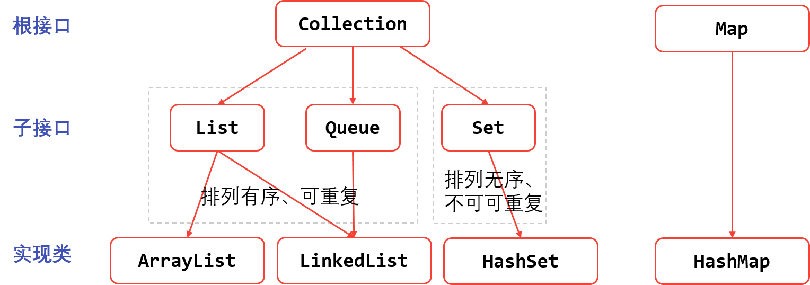

# Java集合框架
存储任意数量具有相同属性的对象
## 一、Java集合框架体系结构

> ArrayList、HashSet、HashMap使用频率高；

## 二、 Collection接口
### 1. List接口及其实现类——ArrayList
- List集合中元素有序可重复，成为序列；
- List可以精确定位元素位置；
- ArrayList称为数组序列，是List的一个重要实现类；
- ArrayList底层是由数组实现的。

1. 创建List实例
``` java
List list = new ArrayList();
```
2. 操作List
- list.add()：添加元素；
- list.addAll(); 
> 可以将Arrays.asList(arr);将数组转变为List

- list.get()：获取元素；
- 通过迭代器遍历List：
``` java
Iterator it = list.iterator();
while(it.hasNext()) {
	it.next();
}
```

- list.set(index, element)：更改index位置上的元素为新的element；
- list.remove()/list.removeAll()：移除元素；

3. 集合泛型
- 泛型集合中，不可添加泛型规定的类型及其子类型以外的对象；
- 泛型集合不可以使用基本类型，如int,long,double，如有需要要使用对用包装类；
``` java
List<Object> list = new ArrayList<Object>();
```

### 2. Set接口及其实现类——HashSet
- Set中元素无序且不可重复，称为集；
- HashSet称为哈希集，是Set的重要实现类；
- 因为无序不能用get()方法获取元素，只能用foreach或者iterator进行迭代，而且每次迭代结果顺序不一样。 

## 三、Map和HashMap
### 1. Map接口
- Map提供一种<key, value>的映射关系，可以实现根据key快速查找value；
- Map中的键值对以Entry类型的对象实例纯在；
- key不可重复，value可重复；
- Map支持泛型，Map<K, V>；

**操作List**
- map.put(key, value)：添加/修改元素；
- map.remove(key)：移除元素；
- map.keySet()：返回key的Set集合；
- map.values()：返回value的集合；
- map.entrySet()：返回映射关系的Set集合

### 2. HashMap类
- HashMap是Map的一个常用的重要实现类，基于哈希表实现；
- HashMap中的Entry对象无序排列；

## 四、解决问题
1. 集合中是否包含某个元素
List/Set  boolean contains(Object);
              boolean containsAll(Collection)
2. 如何判断集合中某个元素的索引位置
List indexOf(Object);
	   lastIndexOf(Object);
3. Map中是否包含某个key或value
Map containsKey();
	    containsValue();

## 五、Collections工具类
- Java集合框架中，用来操作集合对象的工具类；
- 是集合框架的成员；

### 1. 可进行的操作：
- sort(List<>);
> 列表中的元素必须实现Comparable接口。

### 2. Comparable&Comparator接口
- Comparable：默认比较规则；
- Comparator：临时比较规则；

1. Comparable接口——可比较的
- 实现该接口表示：该类的实例可以比较大小，可以惊醒自然排序；
- 第一默认的比较规则；
- 实现类需实现compareTo()方法；
- 使用Collections.sort(List)即可使用默认的comparaTo()比较方法。

2. Comparator接口——比较工具接口
- 用于定义临时比较规则，而不是默认比较规则；
- 实现类需要实现compare()方法；
- 使用compare()临时比较方法需要在Collections.sort(List, Comparator)，传入comparator实例。


## 参考阅读
1.  [Java集合框架 ](http://blog.csdn.net/q547550831/article/details/49516199#)