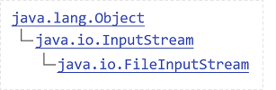
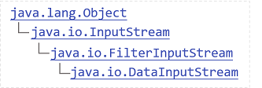
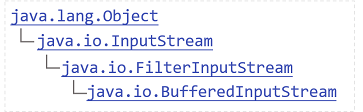

# Java IO流
## 一、文件编码
|编码方式  |中文     |英文    |
|:-------:|:------:|:------:|
|GBK      | 2个字节| 1个字节|
|UTF-8    | 3个字节| 1个字节|
|UTF-16be | 2个字节| 2个字节|
> Java是UTF-16be双字节编码；

## 二、File类
- `java.io.File`类用于表示文件/目录；
- `File`类只能用来表示文件/目录的信息（名称大小等），不能访问文件内容。

**File常用API**
1. 实例化：`new File(URL); `
> URL要用转移字符`\\`、反斜杠`/`或者设置分隔符`File.separator`； 
> File有多个构造器，根据需要选择。

2. `file.exists()`：判断文件/文件夹是否存在；
3. `file.mkdir()/file.mkdirs`：创建目录；
4. `file.delete()`：删除文件/目录；
5. `file.isDirectory()`：判断是否为目录；
6. `file.isFile()`：判断是否为文件；
7. `file.creatNewFile()`：创建文件;
8. `file.getAbsolutePath()`：获得绝对路径；
9. `file.getName()`：获得文件/目录的名称；
10. `file.getParent()`：获得上一级的路径；
11. `file.getParentFile()`：获得上一级的File对象。
12. `file.list()`：列出目录下所有的子目录和文件的名称；
13. `file.listFiles()`：列出目录下所有的子目录和文件的File对象；

## 二、RandomAccessFile
- Java提供的对文件访问的类，既可以读文件，也可以写文件。
- 支持随机访问，可以访问文件的任意位置。

### 1. Java文件模型
- 文件在硬盘上是byte byte byte存储的，是数据的集合；

### 2. 打开模式
- 打开文件文件有两种：“rw”（读写）、“r”（只读）；
- RandomAccessFile构造的时候需要设置读写方式；
- `RandomAccessFile raf = new RandomAccessFile(file, "rw");`

### 3. 写方法
`raf.wrate(int)`：只写一个字节（后8位），同时指正指向下一个位置；

### 4. 读方法
`int b = raf.read()`：读一个字节；

### 5. 文件读写完成后一定要关闭
`raf.close();`

### 6. RandomAccessFile API
- `raf.getFilePointer()`：获得指针位置；
- `raf.seek(0)`：移动指针位置；

## 三、字节流
### 1. InputStream
> 抽象类，抽象了应用程序读取数据的方式

读到-1就读到结尾
#### 1. 输入流基本方法
- int b = in.read()：读一个字节无符号填充的int低八位；
- in.read(byte[] buf)：读取数据填充到字节数组buf；
- in.read(byte[] buf, int start, int size)：读取数据填充到字节数组buf，从buf的start位置开始，存放size长度的数据；

#### 2. FileInputStream子类


具体实现了在文件上读取数据
- 实例化：`FileInputStream in = new FileInputStream(path/file/...);`

#### 3. DataInputStream子类


对流功能的扩展，可以方便读取int，long，字符等类型数据。
- 方法：readInt();/readDouble();/readUTF();/... ...
- 实例化：`DataInputStream dos = new DataInputStream(new FileInputStream(file));`

#### 4. BufferedInputStream子类


提供了带缓冲区的操作，这种流模式提高IO写入写出的性能
- 实例化：`BufferedInputStream bis= new BufferedInputStream (new FileInputStream(file));`

### 2. OutputStream
抽象类，抽象了应用程序写出数据的方式
#### 1. 输入流基本方法
- out.write(int b)：写出一个byte到流，写出b的低八位；
- out.write(byte[] buf)：将buf字节数组都写入到流；
- out.write(byte[] buf, int start, int size)：将字节数组buf，从start位置开始，写入size长度的数据到流；

#### 2. FileOutputStream子类
具体实现了向文件中写出byte数据的方法
- 实例化：`FileOutputStream out = new FileOutputStream(path/file/...);`
- 如果文件不存在则新建文件，若文件存在则重写文件，如果添加一个参数true，则在源文件内追加内容；

#### 3. DataOutputStream子类
对流功能的扩展，可以方便写出int，long，字符等类型数据。
- 方法：writeInt();/writeDouble();/writeUTF();/... ...
- 实例化：`DataOutputStream dos = new DataOutputStream(new FileOutputStream(file));`

#### 4. BufferedOutputStream子类
- 实例化：`BufferedOutputStream bos= new BufferedOutputStream (new FileOutputStream(file));`
- 必须写`bos.flush();`：刷新缓冲区

## 四、字符流
### 1. 认识文本和文本文件
1. Java的文本（char）：是16位无符号整数，是字符的Unicode编码（双字节编码）。
2. 文件：是byte byte byte ... 储存的数据序列。
3. 文本文件：是文本（char）序列按照某种编码方案（utf-8，utf-16be，gbk）序列化为byte的存储结果。

### 2. 字符流（Reader Writer）
1. 操作的是文本文件；
2. 字符的处理，一次处理一个字符；
3. 字符的底层依然是基本的字节序列；

### 3. Reader抽象类
#### InputStreamReader子类
> 完成byte流解析为char流，按照编码解析；

1. 实例化
``` java
InputStreamReader reader = new InputStreamReader(new FileInputStream(), "utf-8");
```

2. int c= reader.read();

### 4. Writer抽象类
#### OutputStreamWriter子类
> 提供char流到byte流，按照编码处理；

1. 实例化
``` java
OutputStreamReader writer = new OutputStreamReader(new FileOutputStream(), "utf-8");
```

2. writer.write();
3. writer.flush();

### 5. FileReader子类（继承自InputStreamReader）
- 实例化：`FileReader fReader = new FileReader(path/file);`

### 6. FileWriter子类（继承自InputStreamWriter）
- 实例化：`FileWriter fWriter = new FileWriter(path/file/...);`
- 如果文件不存在则新建文件，若文件存在则重写文件，如果添加一个参数true，则在源文件内追加内容；

### 7. 字符流过滤器
#### 1. BufferedReader（Reader的实现类）
> 一次读一行；

- 实例化：`BufferedReader bufferReader = new BufferedReader(new InputStreamReader(new FileInputStream()));`
- String line = bufferReader.readLine(); **不识别换行符**

#### 2. BufferedWriter/PrintWriter（Writer的实现类）
> 一次写一行
- 实例化：`BufferedWriter bufferedWriter = new BufferedWriter(new OutputStreamReader(new FileOutputStream()));`
- bufferedWriter.writer(); **不识别换行符**
- bufferedWriter.newLine(); ：换行操作；
- bufferedWriter.flush();

## 五、对象序列化和反序列化
### 1. 对象序列化
就是将Object转换成byte序列，反之叫对象的反序列化。

### 2. 序列化接口（Serializable）
1. 对象必须实现序列化接口，才能进行序列化，否则将会出现异常；
2. 该接口只是一个标准，没有任何方法；

### 3. 序列化流（ObjectOutputStream）
是过滤流
1. 实例化：`ObjectOutputStream objOutput = new ObjectOutputStream(new FileOutputStream(file));`
2. writeObject();

### 4. 反序列化流（ObjectInputStream）
1. 实例化：`ObjectInputStream objInput = new ObjectInputStream(new FileInputStream(file));`
2. readObject();

### 5. transient关键字
1. transient关键字修饰的参数，不会进行JVM默认的序列化；
2. 可以自己写方法实现序列化：
参考ArrayList源码：
``` java
    private void writeObject(java.io.ObjectOutputStream s)
        throws java.io.IOException{
        s.defaultWriteObject();
        s.writeInt(prama);
        s.writeObject(prama);
```
- s.defaultWriteObject();：把JVM能默认序列化的元素进行序列化操作;
- s.writeInt(prama);：自己完成int类型的序列化；
- s.writeObject(prama);：自己完成对象序列化；

3. 可以自己写方法实现反序列化：
参考ArrayList源码：
``` java
private void readObject(java.io.ObjectInputStream s)
        throws java.io.IOException, ClassNotFoundException {
        s.defaultReadObject();
        this.prama = s.readInt();
        this.Obj = s.readObject();
    }
```
- s.defaultReadObject();：把JVM能默认反序列化的元素进行反序列化操作;
- s.readInt();：自己完成int类型的反序列化；
- s.readObject();：自己完成对象反序列化；

4. 父类实现了序列化接口，子类就不用实现序列化接口
> 在父类没有实现 Serializable 接口时，虚拟机是不会序列化父对象的，也就是说序列化后的流中没有父类的信息；而一个 Java 对象的构造必须先有父对象，才有子对象，反序列化也不例外。所以反序列化时，为了构造父对象，只能调用父类的无参构造函数作为默认的父对象。