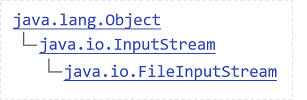
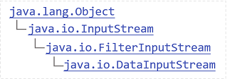
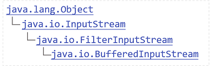

# Java IO流
## 一、文件编码
|编码方式  |中文     |英文    |
|:-------:|:------:|:------:|
|GBK      | 2个字节| 1个字节|
|UTF-8    | 3个字节| 1个字节|
|UTF-16be | 2个字节| 2个字节|
> Java是UTF-16be双字节编码；

## 二、File类
- java.io.File类用于表示文件/目录；
- File类只能用来表示文件/目录的信息（名称大小等），不能访问文件内容。

**File常用API**
1. 实例化：new File(URL); 
> URL要用转移字符`\\`、反斜杠`/`或者设置分隔符`File.separator`； 
> File有多个构造器，根据需要选择。

2. file.exists()：判断文件/文件夹是否存在；
3. file.mkdir()/file.mkdirs：创建目录；
4. file.delete()：删除文件/目录；
5. file.isDirectory()：判断是否为目录；
6. file.isFile()：判断是否为文件；
7. file.creatNewFile()：创建文件;
8. file.getAbsolutePath()：获得绝对路径；
9. file.getName()：获得文件/目录的名称；
10. file.getParent()：获得上一级的路径；
11. file.getParentFile()：获得上一级的File对象。
12. file.list()：列出目录下所有的子目录和文件的名称；
13. file.listFiles()：列出目录下所有的子目录和文件的File对象；

## 二、RandomAccessFile
- Java提供的对文件访问的类，既可以读文件，也可以写文件。
- 支持随机访问，可以访问文件的任意位置。

### 1. Java文件模型
- 文件在硬盘上是byte byte byte存储的，是数据的集合；

### 2. 打开模式
- 打开文件文件有两种：“rw”（读写）、“r”（只读）；
- RandomAccessFile构造的时候需要设置读写方式；
- RandomAccessFile raf = new RandomAccessFile(file, "rw");

### 3. 写方法
raf.wrate(int)：只写一个字节（后8位），同时指正指向下一个位置；

### 4. 读方法
int b = raf.read()：读一个字节；

### 5. 文件读写完成后一定要关闭
raf.close();

### 6. RandomAccessFile API
- raf.getFilePointer()：获得指针位置；
- raf.seek(0)：移动指针位置；

## 三、字节流
### 1. InputStream
> 抽象类，抽象了应用程序读取数据的方式

读到-1就读到结尾
#### 1. 输入流基本方法
- int b = in.read()：读一个字节无符号填充的int低八位；
- in.read(byte[] buf)：读取数据填充到字节数组buf；
- in.read(byte[] buf, int start, int size)：读取数据填充到字节数组buf，从buf的start位置开始，存放size长度的数据；

#### 2. FileInputStream子类

具体实现了在文件上读取数据
- 实例化：FileInputStream in = new FileInputStream(path/file/...);

#### 3. DataInputStream子类

对流功能的扩展，可以方便读取int，long，字符等类型数据。
- 方法：readInt();/readDouble();/readUTF();/... ...
- 实例化：DataInputStream dos = new DataInputStream(new FileInputStream(file));

#### 4. BufferedInputStream子类

提供了带缓冲区的操作，这种流模式提高IO写入写出的性能
- 实例化：BufferedInputStream bis= new BufferedInputStream (new FileInputStream(file));

### 2. OutputStream
抽象类，抽象了应用程序写出数据的方式
#### 1. 输入流基本方法
- out.write(int b)：写出一个byte到流，写出b的低八位；
- out.write(byte[] buf)：将buf字节数组都写入到流；
- out.write(byte[] buf, int start, int size)：将字节数组buf，从start位置开始，写入size长度的数据到流；

#### 2. FileOutputStream子类
具体实现了向文件中写出byte数据的方法
- 实例化：FileOutputStream out = new FileOutputStream(path/file/...);
- 如果文件不存在则新建文件，若文件存在则重写文件，如果添加一个参数true，则在源文件内追加内容；

#### 3. DataOutputStream子类
对流功能的扩展，可以方便写出int，long，字符等类型数据。
- 方法：writeInt();/writeDouble();/writeUTF();/... ...
- 实例化：DataOutputStream dos = new DataOutputStream(new FileOutputStream(file));

#### 4. BufferedOutputStream子类
- 实例化：BufferedOutputStream bos= new BufferedOutputStream (new FileOutputStream(file));
- 必须写bos.flush();：刷新缓冲区

 

