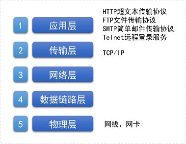
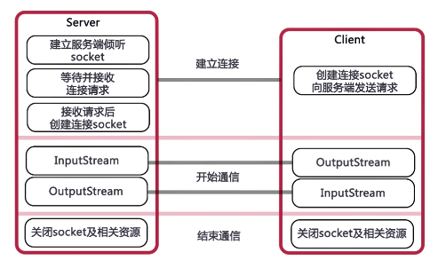
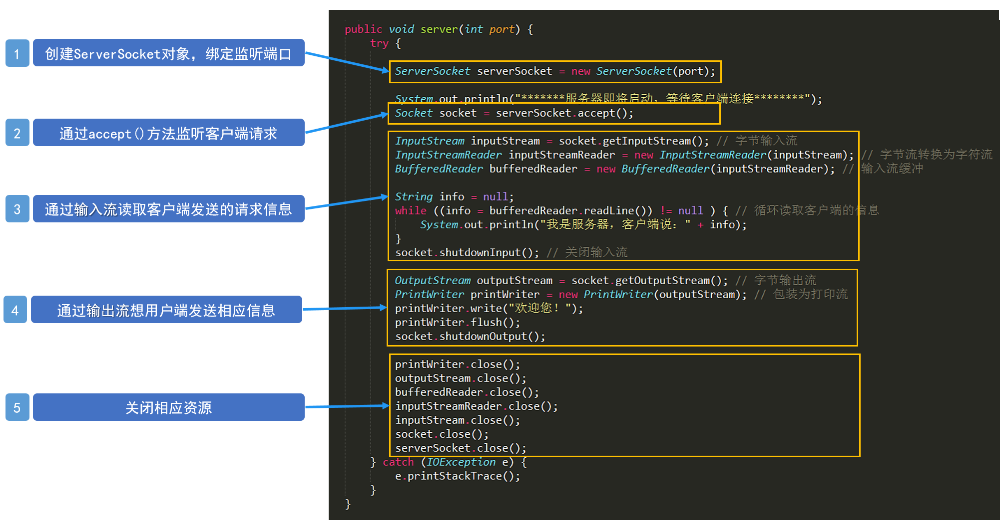
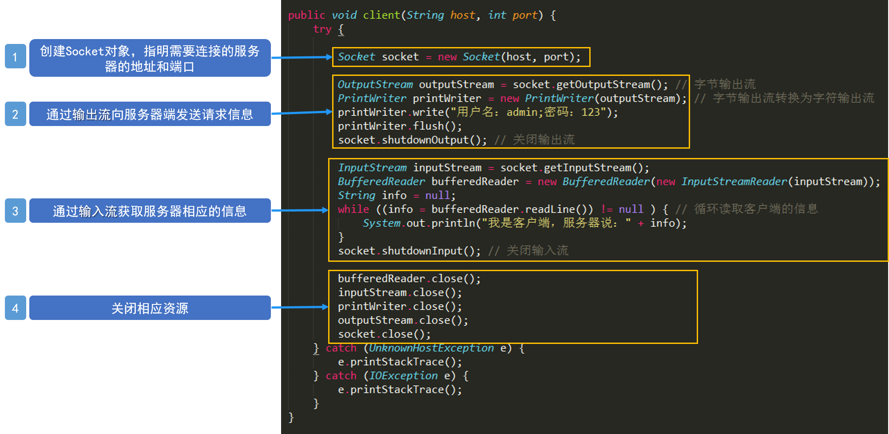

# Java Socket通信
## 一、网络基础
### 1. 计算机之间网络通信的必备条件
#### 1. IP地址

#### 2. 协议
1. TCP/IP是目前世界上应用最广泛的协议
- 是以TCP和IP为基础的不同层次上多个协议的集合，也称为ICP/IP协议族或ICP/IP协议栈；
- TCP：Transmission Control Protocol（传输控制协议）
- IP：Internet Protocol（互联网协议）
2. TCP/IP模型（5层）


#### 3. 端口号
1. 用于区分不同应用；
2. 端口号范围：0-65535，其中0-1023为系统保留；
3. **IP地址**和**端口号**组成了所谓的`Socket`，`Socket`是网络运行的程序之间双向通信链路的终结点，是TCP和UDP的基础；
4. 常用端口号：
- HTTP：80；
- FTP：21；
- Telnet：23

### 2. Java中的网络支持
1. InetAddress类：用于表示网络上的硬件资源（用于表示IP地址相关信息）；
2. URL：统一资源定位符，通过URL可以直接读取或写入网络上的数据；
3. Sockets：使用TCP协议实现网络通信的Socket相关的类；
4. Datagram：使用UDP协议，将数据保存在数据报中，通过网络进行通信。

## 二、InetAddress类
用于表示网络上的硬件资源，表示IP地址的相关信息。
### 1. 获取InetAddress对象实例
1. 获取本机InetAddress实例
```
InetAddress address = InetAddress.getLocalHost();
```
2. 根据机器名或者IP地址获取InetAddress实例
```
InetAddress address = InetAddress.getByName(IP/HostName);
```

### 2. 获取InetAddress相关信息
- 获取主机名：`address.getHostName();`
- 获取IP地址：`address.getHostAddress();`
- 获取字节数组形式的IP地址：`byte[] bytes = address.getAddress();`

## 三、URL
1. Uniform Resource Locator：统一资源定位符，表示Internet上某一资源的地址。
2. URL组成：协议名+资源名称，中间用冒号隔开；
3. java.net包中，提供了URL类来表示URL。
### 1. URL操作
```
//创建一个URL实例
URL imooc=new URL("http://www.imooc.com");
//?后面表示参数，#后面表示锚点
URL url=new URL(imooc, "/index.html?username=tom#test");
System.out.println("协议："+url.getProtocol());
System.out.println("主机："+url.getHost());
//如果未指定端口号，则使用默认的端口号，此时getPort()方法返回值为-1
System.out.println("端口："+url.getPort());
System.out.println("文件路径："+url.getPath());
System.out.println("文件名："+url.getFile());
System.out.println("相对路径："+url.getRef());
System.out.println("查询字符串："+url.getQuery());
```

### 2. 使用URL读取网页内容
1. 通过URL对象的openStream()方法可以得到指定资源的输入流；
2. 通过输入流可以读取、访问网络上的数据。
```
//创建一个URL实例
URL url = new URL("http://www.baidu.com");
//通过URL的openStream方法获取URL对象所表示的资源的字节输入流
InputStream is = url.openStream();
//将字节输入流转换为字符输入流
InputStreamReader isr = new InputStreamReader(is, "utf-8");
//为字符输入流添加缓冲
BufferedReader br = new BufferedReader(isr);
String data = br.readLine();//读取数据
while (data != null) {//循环读取数据
	System.out.println(data);//输出数据
	data = br.readLine();
}
br.close();
isr.close();
is.close();
```

## 四、Socket通信
### 1. Socket实现TCP通信
#### 1.TCP基础
1. TCP协议是面相连接的、可靠的、有序的，以字节流的方式发送数据；
2. 基于TCP协议实现网络通信的类：
- 客户端的Socket类；
- 服务器端的ServerSocket类

#### 2. Socket通信模型


#### 3. Socket通信实现步骤
1. 分别在客户端和服务端创建ServerSocket和Socket；
2. 打开连接到Socket的输入/输出流，进行数据通信；
3. 按照协议对Socket进行读写操作；
4. 关闭输入输出流，关闭Socket。

#### 4. 案例（用户登录）
**服务器端**
1. 创建ServerSocket对象，绑定监听端口；
2. 通过accept()方法监听客户端请求；
3. 建立连接后，通过输入流读取客户端发送的请求信息；
4. 通过输出流向用户端发送相应信息；
5. 关闭相应资源


**客户端**
1. 创建Socket对象，指明需要连接的服务器的地址和端口号；
2. 连接建立后，通过输出流向服务器端发送请求信息；
3. 通过输入流获取服务器相应的信息；
4.  关闭相应资源


> 注：服务器端要早于客户端启动

**多线程服务器**
用多线程来实现服务器与多客户端之间的通信
1. 服务器端创建ServerSocket，循环调用accept();
2. 客户端创建一个Socket并请求和服务器端连接；
3. 服务器端接受客户端请求，创建Socket与该客户建立专线连接；
4. 建立连接的两个Socket在一个单独的线程上对话；
5. 服务器端继续等待新的连接。

### 2. Socket实现UDP通信
#### 1. UDP基础
1. UDP协议（User Datagram Protocol，用户数据报协议）是无连接、不可靠的、无序的
2. UDP协议以数据报作为数据传输的载体

#### 2. UDP编程
1. UDP进行数据传输是首先需要将要传输的数据定义成数据报（Datagram），在数据报中指明数据索要到达的Socket（主机地址和端口号），然后再将数据报发出去。
2. 相关操作类：
- DatagramPacket：比搜啊会数据报包；
- DatagramSocket：进行端到端通信的类。

#### 3. 实现步骤
**服务器端**
1. 创建DatagramSocket，指定端口号；
2. 创建DatagramPacket
3. 接收客户端发送的数据信息
4. 读取数据

**客户端**
1. 定义发送信息
2. 创建DatagramSocket包含发送的信息；
3. 创建DatagramSocket
4. 发送数据

#### 4. 注意问题
1. 多线程的优先级
``` java
thread.setPriority(4);
```
线程优先级，范围1-10，默认为5
> 未设置优先级可能会导致运行时非常慢，可降低优先级。

2. 是否关闭输入输出流
对于同一个Socket，如果关闭了输出流，则与该输出流关联的Socket也会被关闭，所以一般不用关闭流，直接Socket即可。

3. 使用TCP通信传输对象
使用ObjectOutputStream对象序列化流，传递对象
``` java
ObjectOutputStream objectOutput = new ObjectOutputStream(OutputStream);
```
序列化
``` java
objectOutput.writeObject(user);
```

4. Socket编程传递文件
``` java
BufferedOutputStream bufferedOutput = new BufferedOutputStream(new FileOutputStream(new File(path)));
```