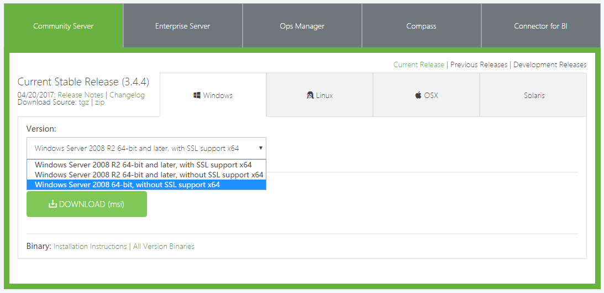
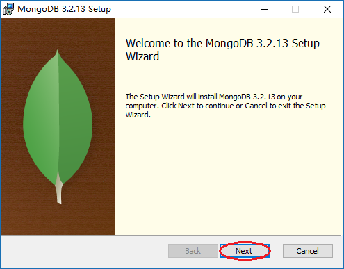
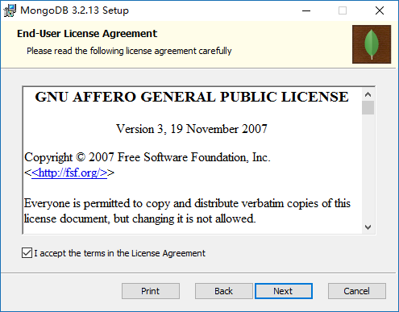
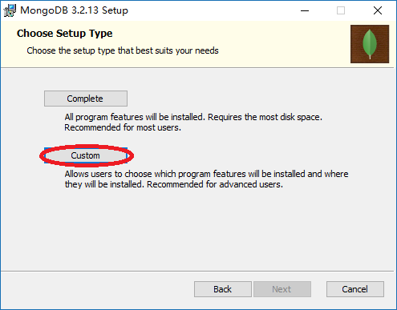
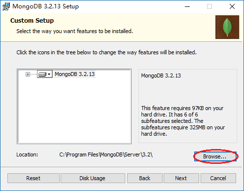
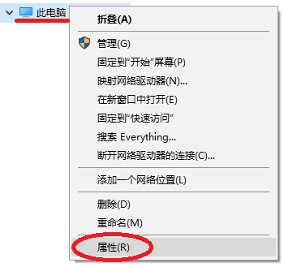
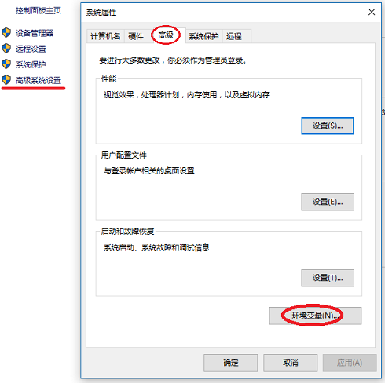
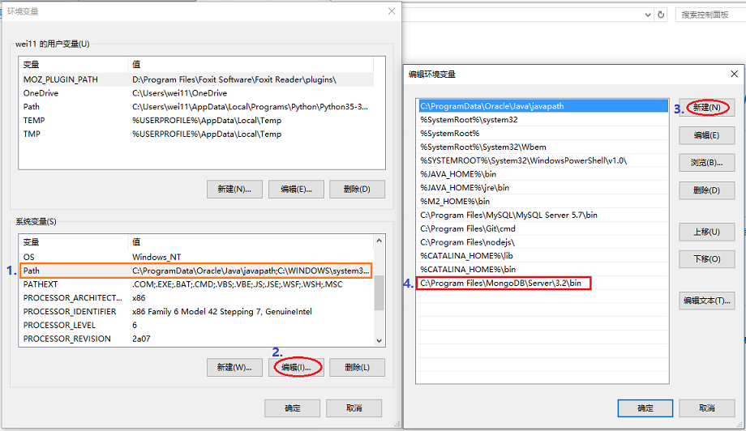
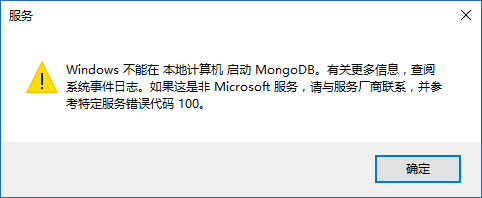

# MongoDB 安装（Win10 x86）
[官方安装文档](https://docs.mongodb.com/manual/tutorial/install-mongodb-on-windows/)
> 对于还鏖战在32位系统的朋友，应该深深感受到了要被抛弃的感觉。最近需要安装Adobe全家桶、Redis和MongoDB的我就感受颇深，要多花出数倍的时间和经历去寻找资源和解决问题。这篇文章就是为了帮助和我情况相同的朋友们，希望能为你们节省一些时间。

## 1. 下载安装包
目前MongoDB已经不提供32位安装包的下载了：


所以请大家移步到：[MongoDB32位下载地址](https://www.mongodb.org/dl/win32/i386)，下载msi安装文件。
> 如果访问不了官方下载地址的话，可以从百度云下载（链接: http://pan.baidu.com/s/1bp2AScZ 密码: dd6k）

## 2. 安装
自定义安装都是直接下一步的，就不多说。

值得一提的是MongoDB是独立的不依赖与系统，所以可以安装到任何一个文件夹，自定义安装过程为：
### 1. 双击安装包，点击Next


### 2. 接受协议


### 3. 选择Custom（自定义）


### 4. 点击Browse选择文件夹，确定后点击Next


### 5. 点击Install即可。

## 3. 创建文件夹
创建文件夹用于存放数据库文件和日志文件
```
mkdir d:\MongoDB\data\db
mkdir d:\MongoDB\data\log
```

## 4、配置环境
在D:\MongoDB目录下创建配置文件：mongod.cfg
```
bind_ip = 127.0.0.1
port = 27017
logpath = d:/MongoDB/data/log/mongod.log
dbpath = d:/MongoDB/data/db
journal = true
```
> 注：配置文件的编码必须是ASCII编码。不能使用UTF-8在内的非ASCII编码。
> [官方配置文件文档](https://docs.mongodb.com/manual/reference/configuration-options/)

## 4、安装服务
> 以管理员模式运行命令行
```
"C:\Program Files\MongoDB\Server\3.2\bin\mongod.exe" --config "D:\MongoDB\mongod.cfg" --install --storageEngine=mmapv1
```

1. 启动服务
```
net start mongodb
```

2. 停止服务
```
net stop mongodb
```

3. 移除MongoDB服务
```
"C:\Program Files\MongoDB\Server\3.2\bin\mongod.exe" --remove
```

## 5. 配置环境变量*
通过配置环境变量，使用命令提示符操作MongoDB将会变得更加方便。
### 1. 进入系统控制面板
我的电脑（此电脑）右键，选择属性：


### 2. 进入系统属性
选择高级系统设置，在**高级**标签页内选择环境变量：


### 3. 设置环境变量
找到变量为**path**的变量，将MongoDB的bin目录的全路径添加到path变量。


点击确定即可。

---------
这样就完成32位系统的MongoDB的安装，现在你可以通过运行客户端`C:\Program Files\MongoDB\Server\3.2\bin\mongo.exe`或者通过你编写的程序操作MongoDB数据库了。


## 6. 错误处理
启动MongoDB的服务时，报错：

并在日志中出现：
```
exception in initAndListen: 28663 Cannot start server. The default storage engine 'wiredTiger' is not available with this build of mongod. Please specify a different storage engine explicitly, e.g. --storageEngine=mmapv1., terminating
```

先移除MongoDB服务
```
"C:\Program Files\MongoDB\Server\3.2\bin\mongod.exe" --remove
```

将storageEngine改为mmapv1
```
"C:\Program Files\MongoDB\Server\3.2\bin\mongod.exe" --config "D:\MongoDB\mongod.cfg" --install --storageEngine=mmapv1
```

## 7. MongoDB文件结构
| 组件       | 文件名  |
| :-------- | :-------- |
| 服务              | mongod.exe                |
| 路由              | mongos.exe                 |
| 客户端            | mongo.exe                  |
| 检测工具          | mongostat.exe, mongotop.exe| 
| 导入导出工具       | mongodump.exe, mongorestore.exe, mongoexport.exe, mongoimport.exe|
| 其他工具           | 	bsondump.exe, mongofiles.exe, mongooplog.exe, mongoperf.exe|