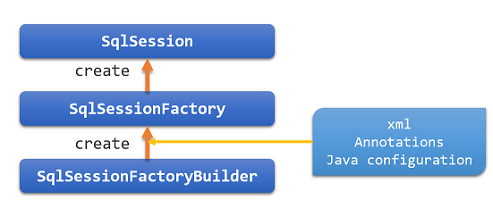

# MyBatis Java API
[官方文档](http://www.mybatis.org/mybatis-3/zh/java-api.html)

## 1. SqlSessions
1. SqlSession是MyBatis工作的主要Java类。通过SqlSession可以操作命令，获取映射并管理事务。

2. SqlSession由 SqlSessionFactory实例创建，SqlSessionFactory由 SqlSessionFactoryBuilder实例通过XML、注解或者编写Java配置代码创建。


## 2. SqlSessionFactoryBuilder
SqlSessionFactoryBuilder有五种build()方法：
``` java
SqlSessionFactory build(InputStream inputStream)
SqlSessionFactory build(InputStream inputStream, String environment)
SqlSessionFactory build(InputStream inputStream, Properties properties)
SqlSessionFactory build(InputStream inputStream, String env, Properties props)
SqlSessionFactory build(Configuration config)
```
### 1. 前四种最为常见
他们需要通过InputStream实例读取XML文件
1. 创建SqlSessionFactory的示例：
``` java
String resource = "org/mybatis/builder/mybatis-config.xml";
InputStream inputStream = Resources.getResourceAsStream(resource);
SqlSessionFactoryBuilder builder = new SqlSessionFactoryBuilder();
SqlSessionFactory factory = builder.build(inputStream);
```

2. Resources类
由上例可以看到，用Resources读取了配置文件。
``` java
Resources包含的方法：
URL getResourceURL(String resource)
URL getResourceURL(ClassLoader loader, String resource)
InputStream getResourceAsStream(String resource)
InputStream getResourceAsStream(ClassLoader loader, String resource)
Properties getResourceAsProperties(String resource)
Properties getResourceAsProperties(ClassLoader loader, String resource)
Reader getResourceAsReader(String resource)
Reader getResourceAsReader(ClassLoader loader, String resource)
File getResourceAsFile(String resource)
File getResourceAsFile(ClassLoader loader, String resource)
InputStream getUrlAsStream(String urlString)
Reader getUrlAsReader(String urlString)
Properties getUrlAsProperties(String urlString)
Class classForName(String className)
```

### 2. 最后一种
最后一种方法需要获取一个Configuration实例。
Configuration类对有利于配置自查，包括查找可控制SQL映射（一旦成需接受请求就不建议这么做了）。
使用Configuration类来创建SqlSessionFactory实例的例子：
``` java
DataSource dataSource = BaseDataTest.createBlogDataSource();
TransactionFactory transactionFactory = new JdbcTransactionFactory();

Environment environment = new Environment("development", transactionFactory, dataSource);

Configuration configuration = new Configuration(environment);
configuration.setLazyLoadingEnabled(true);
configuration.setEnhancementEnabled(true);
configuration.getTypeAliasRegistry().registerAlias(Blog.class);
configuration.getTypeAliasRegistry().registerAlias(Post.class);
configuration.getTypeAliasRegistry().registerAlias(Author.class);
configuration.addMapper(BoundBlogMapper.class);
configuration.addMapper(BoundAuthorMapper.class);

SqlSessionFactoryBuilder builder = new SqlSessionFactoryBuilder();
SqlSessionFactory factory = builder.build(configuration);
```

## 3. SqlSessionFactory
SqlSessionFactory有六种创建SqlSession实例的方法，可以根据以下三个方面去选择使用哪个方法：
- Transaction：是否为Session设置事务范围，或是使用自动提交（通常意味着多数数据库或者JDBC驱动不支持事务）；
- Connection：是否需要MyBatis根据配置的数据源来获取连接，还是希望自己提供连接；
- Execution：是否需要重用PreparedStatements 和（或）批量更新语句（包括插入和删除）
``` java
SqlSession openSession()
SqlSession openSession(boolean autoCommit)
SqlSession openSession(Connection connection)
SqlSession openSession(TransactionIsolationLevel level)
SqlSession openSession(ExecutorType execType,TransactionIsolationLevel level)
SqlSession openSession(ExecutorType execType)
SqlSession openSession(ExecutorType execType, boolean autoCommit)
SqlSession openSession(ExecutorType execType, Connection connection)
Configuration getConfiguration();
```
参数说明：
- autoCommit：是否开启自动提交；
- Connection ：提供自定义连接；
- TransactionIsolationLevel ：事务隔离级别，提供JDBC支持的5个隔离级别（NONE, READ_UNCOMMITTED, READ_COMMITTED, REPEATABLE_READ, SERIALIZABLE）；
- ExecutorType ：执行器类型（ExecutorType.SIMPLE，ExecutorType.REUSE，ExecutorType.BATCH）

> 最后的getConfiguration()方法会返回一个Configuration对象，在运行时可以用来自检MyBatis的配置。

## 4. SqlSession
SqlSession实例实是MyBatis中最强大的类，它提供了执行语句，提交或者回滚事务和获取映射实例的方法，这些方法有20多个，下面将分组来看。
### 1. 语句执行方法
这些方法用来执行在SQL映射XML文件中定义的语句（SELECT，INSERT，UPDATE和DELETE）
``` java
<T> T selectOne(String statement, Object parameter)
<E> List<E> selectList(String statement, Object parameter)
<K,V> Map<K,V> selectMap(String statement, Object parameter, String mapKey)
int insert(String statement, Object parameter)
int update(String statement, Object parameter)
int delete(String statement, Object parameter)
```
- statement：需要执行语句的ID；
- parameter：参数对象，可以 是原生类型(自动装箱或包装类) ，JavaBean，POJO 或 Map。

> 1. selectOne 必须返回一个对象，如果多余一个，或者 没有返回 (或返回了 null) 那么就会抛出异常。如果你不知道需要多少对象, 使用 selectList；
> 2. 如果想检测摸个记录是否存在，最好返回统计数（0或1）；
> 3. selectMap用来将结果列表映射到一个Map，这个Map基于结果对象的某一属性；
> 4. insert，update和delete方法的返回值表示收该语句影响的行数。

**语句执行方法的高级版本**
高级方法常用于大数据集的情况下，允许限定返回行数的范围，或者提供自定义结果处理逻辑。
``` java
<E> List<E> selectList (String statement, Object parameter, RowBounds rowBounds)
<K,V> Map<K,V> selectMap(String statement, Object parameter, String mapKey, RowBounds rowbounds)
void select (String statement, Object parameter, ResultHandler<T> handler)
void select (String statement, Object parameter, RowBounds rowBounds, ResultHandler<T> handler)
```
1. RowBounds：指定跳过指定的记录数，以及限制返回结果的数量。
需要创建RowBounds对象：
``` java
int offset = 100;
int limit = 25;
RowBounds rowBounds = new RowBounds(offset, limit);
```

2. ResultHandler：自定义结果处理器，自定义处理每一行结果。
需要实现ResultHandler接口。
> ResultHandler的具体内容参看官方文档。

### 2. 刷新批量更新方法
随时刷新（执行）存储在JDBC驱动类中的批量更新语句的方法。
当`ExecutorType`为`ExecutorType.BATCH`时，使用该方法：
``` java
List<BatchResult> flushStatements()
```

### 3. 事务控制方法
有四个控制事务域的方法。如果选择了自动提交或是是使用外部事务管理器的话，这四个方法是不起作用的。如果使用的是JDBC的事务管理器（由Connection实例管理），这个方法可以起作用。
``` java
void commit()
void commit(boolean force)
void rollback()
void rollback(boolean force)
```
1. 默认情况下，MyBatis不会自动提交事务，除非有insert, update或delete操作更改数据库。如果没有调用insert, update或delete方法就实现了这些更改，则需要给commit()和rollback()传递True强制提交。
2. 通常不一定需要调用 rollback()，如果没有调用commit()，MyBatis会自动回滚。如果需要对多次提交和回滚进行更细粒度的控制的话，可以选择进行回滚。

### 4. 本地缓存
MyBatis有两种缓存：本地缓存和二级缓存
1. 每次创建一个session，MyBatis就会创建一个本地缓存并将其附加给session。session执行任何查询都会别储存在本地缓存中，这样当后面执行具有相同参数的同一查询时就不会访问数据库了。本地缓存在更新，提交，回滚和关闭时会被清除。
2. 默认情况下，本地缓存作用于整个会话持续时间。本地缓存用于解决循环引用和加快重复的嵌套查询，因此本地缓存不会完全禁用，但是可以通过设置`localCacheScope = STATEMENT`，使本地缓存只能在语句执行期间使用。
3. 设置`localCacheScope = SESSION`时，MyBatis返回存储在本地缓存中的相同对象的引用。返回对象（列表等）的任何修改都会影响本地缓存的内容，并且随后会影响在会话生命周期从缓存返回的值。因此，最好不要修改MyBatis返回的对象。
4. 可以通过调用以下方法随时清空本地缓存：
``` java
void clearCache()
```

### 5. 确保关闭SqlSession
确保将打开的会话全部关闭最好的方法使用以下代码块儿：
``` java
SqlSession session = sqlSessionFactory.openSession();
try {
    // following 3 lines pseudocode for "doing some work"
    session.insert(...);
    session.update(...);
    session.delete(...);
    session.commit();
} finally {
    session.close();
}
```
如果使用Java 1.7+和MyBatis 3.2+，还可以使用try-with-resources语句：
``` java
try (SqlSession session = sqlSessionFactory.openSession()) {
    // following 3 lines pseudocode for "doing some work"
    session.insert(...);
    session.update(...);
    session.delete(...);
    session.commit();
}
```

### 6. 获取Configuration实例
SqlSession可以调用getConfiguration() 方法，像SqlSessionFactory一样获取Configuration 实例：
``` java
Configuration getConfiguration()
```

### 7. 使用映射器
``` java
<T> T getMapper(Class<T> type)
```
上面所说的各种增删改查的方法都很强大，但是也很繁琐，既不是类型安全的，也对IDE或者单元测试没有益处。
因此，处理映射语句更常用的方法是使用Mapper类。一个Mapper类是一个接口，接口中定义的方法与SqlSession方法对应匹配：
``` java
public interface AuthorMapper {
  // (Author) selectOne("selectAuthor",5);
  Author selectAuthor(int id); 
  // (List<Author>) selectList(“selectAuthors”)
  List<Author> selectAuthors();
  // (Map<Integer,Author>) selectMap("selectAuthors", "id")
  @MapKey("id")
  Map<Integer, Author> selectAuthors();
  // insert("insertAuthor", author)
  int insertAuthor(Author author);
  // updateAuthor("updateAuthor", author)
  int updateAuthor(Author author);
  // delete("deleteAuthor",5)
  int deleteAuthor(int id);
}
```
1. 总之，每个映射器方法签名应该与它相关联的SqlSession方法相对应，但不包含String参数ID。相反，方法名必须匹配映射语句的ID。
2. 另外，返回类型必须与单个结果的预期结果相匹配，或与多个结果的数组或集合相匹配。支持所有常见类型：原生类型，Map，POJO和JavaBean。
3. 映射器接口不需要实现或者继承其他类；
4. 可以给映射器方法传递多个方法，他们会默认以＃{param1}，＃{param2}形式命名调用。可以通过注解`@Param(“paramName”)`来更改参数名称（仅限多个参数）。
5. 可以给方法传递一个RowBounds实例限制查询结果。